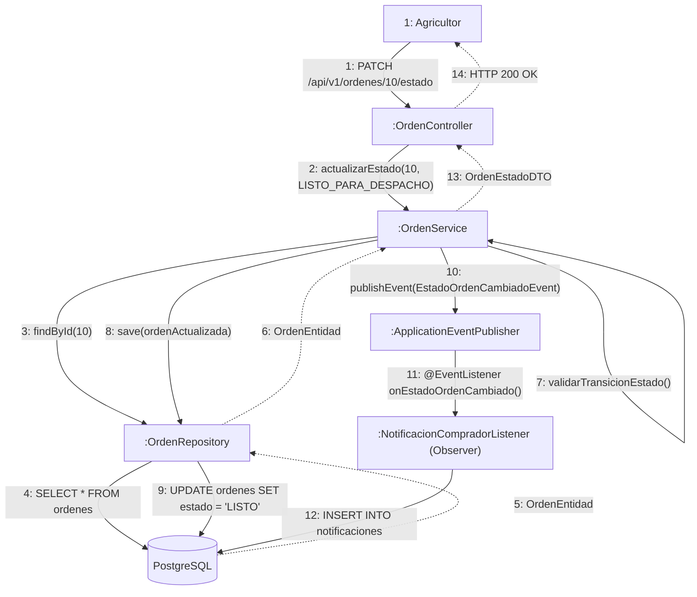

###Diagrama de Colaboración 2: Actualización de Despacho y Notificación.

```mermaid
flowchart TD
    A["1: Agricultor"]
    CTRL[":OrdenController"]
    SERV[":OrdenService"]
    OREPO[":OrdenRepository"]
    PUB[":ApplicationEventPublisher"]
    OBS[":NotificacionCompradorListener (Observer)"]
    DB[("PostgreSQL")]

    A -- "1: PATCH /api/v1/ordenes/10/estado" --> CTRL
    CTRL -- "2: actualizarEstado(10, LISTO_PARA_DESPACHO)" --> SERV
    SERV -- "3: findById(10)" --> OREPO
    OREPO -- "4: SELECT * FROM ordenes" --> DB
    DB -. "5: OrdenEntidad" .-> OREPO
    OREPO -. "6: OrdenEntidad" .-> SERV
    SERV -- "7: validarTransicionEstado()" --> SERV
    SERV -- "8: save(ordenActualizada)" --> OREPO
    OREPO -- "9: UPDATE ordenes SET estado = 'LISTO'" --> DB
    SERV -- "10: publishEvent(EstadoOrdenCambiadoEvent)" --> PUB
    PUB -- "11: @EventListener onEstadoOrdenCambiado()" --> OBS
    OBS -- "12: INSERT INTO notificaciones" --> DB
    SERV -. "13: OrdenEstadoDTO" .-> CTRL
    CTRL -. "14: HTTP 200 OK" .-> A
```
