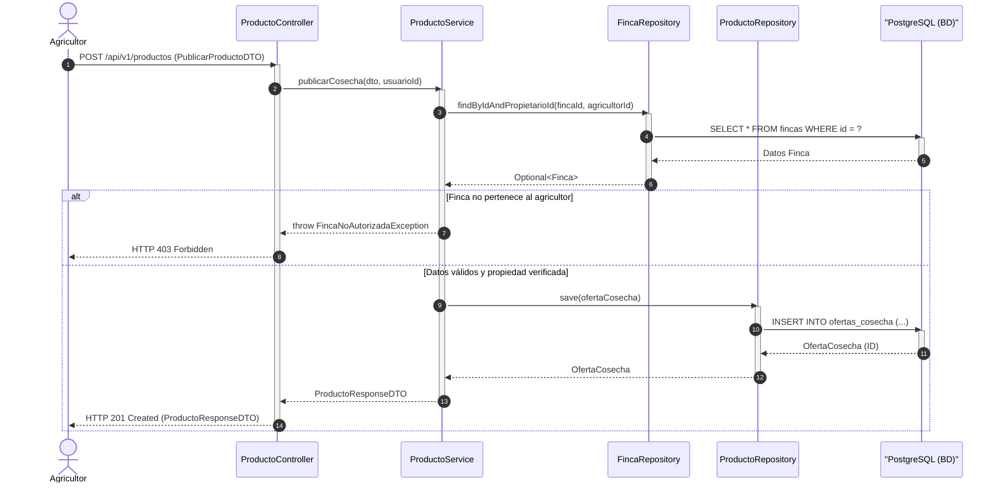
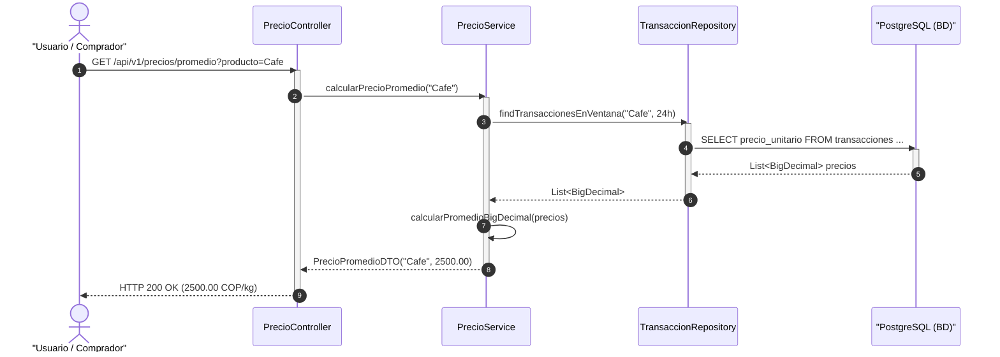

### Diagrama de Secuencia: Registro/Publicación de Cosecha (HU-02)

```mermaid
sequenceDiagram
    autonumber
    actor Cliente as Agricultor
    participant Controller as ProductoController
    participant Service as ProductoService
    participant FincaRepo as FincaRepository
    participant ProdRepo as ProductoRepository
    participant DB as "PostgreSQL (BD)"

    Cliente->>Controller: POST /api/v1/productos (PublicarProductoDTO)
    activate Controller
    Controller->>Service: publicarCosecha(dto, usuarioId)
    activate Service
    Service->>FincaRepo: findByIdAndPropietarioId(fincaId, agricultorId)
    activate FincaRepo
    FincaRepo->>DB: SELECT * FROM fincas WHERE id = ?
    activate DB
    DB-->>FincaRepo: Datos Finca
    deactivate DB
    FincaRepo-->>Service: Optional<Finca>
    deactivate FincaRepo

    alt Finca no pertenece al agricultor
        Service-->>Controller: throw FincaNoAutorizadaException
        Controller-->>Cliente: HTTP 403 Forbidden
    else Datos válidos y propiedad verificada
        Service->>ProdRepo: save(ofertaCosecha)
        activate ProdRepo
        ProdRepo->>DB: INSERT INTO ofertas_cosecha (...)
        activate DB
        DB-->>ProdRepo: OfertaCosecha (ID)
        deactivate DB
        ProdRepo-->>Service: OfertaCosecha
        deactivate ProdRepo
        Service-->>Controller: ProductoResponseDTO
        deactivate Service
        Controller-->>Cliente: HTTP 201 Created (ProductoResponseDTO)
    end
    deactivate Controller
```
### Diagrama de Secuencia: Consulta de Precios Promedio (HU-03)

```mermaid
sequenceDiagram
    autonumber
    actor Cliente as "Usuario / Comprador"
    participant Controller as PrecioController
    participant Service as PrecioService
    participant Repo as TransaccionRepository
    participant DB as "PostgreSQL (BD)"

    Cliente->>Controller: GET /api/v1/precios/promedio?producto=Cafe
    activate Controller
    Controller->>Service: calcularPrecioPromedio("Cafe")
    activate Service
    Service->>Repo: findTransaccionesEnVentana("Cafe", 24h)
    activate Repo
    Repo->>DB: SELECT precio_unitario FROM transacciones ...
    activate DB
    DB-->>Repo: List<BigDecimal> precios
    deactivate DB
    Repo-->>Service: List<BigDecimal>
    deactivate Repo
    Service->>Service: calcularPromedioBigDecimal(precios)
    Service-->>Controller: PrecioPromedioDTO("Cafe", 2500.00)
    deactivate Service
    Controller-->>Cliente: HTTP 200 OK (2500.00 COP/kg)
    deactivate Controller
```
