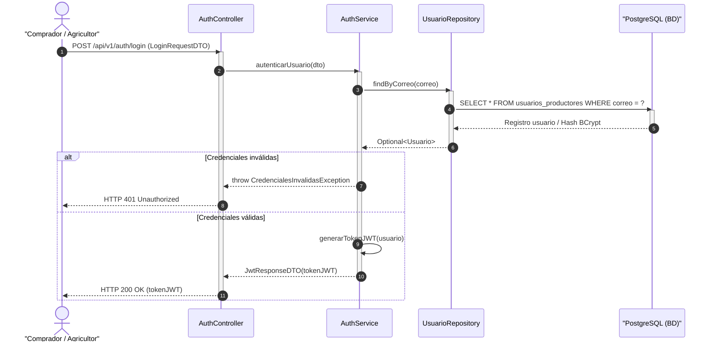

### Diagrama de Secuencia: Login JWT

```mermaid
sequenceDiagram
    autonumber
    actor Cliente as "Comprador / Agricultor"
    participant Controller as AuthController
    participant Service as AuthService
    participant Repo as UsuarioRepository
    participant DB as "PostgreSQL (BD)"

    Cliente->>Controller: POST /api/v1/auth/login (LoginRequestDTO)
    activate Controller
    Controller->>Service: autenticarUsuario(dto)
    activate Service
    Service->>Repo: findByCorreo(correo)
    activate Repo
    Repo->>DB: SELECT * FROM usuarios_productores WHERE correo = ?
    activate DB
    DB-->>Repo: Registro usuario / Hash BCrypt
    deactivate DB
    Repo-->>Service: Optional<Usuario>
    deactivate Repo

    alt Credenciales inválidas
        Service-->>Controller: throw CredencialesInvalidasException
        Controller-->>Cliente: HTTP 401 Unauthorized
    else Credenciales válidas
        Service->>Service: generarTokenJWT(usuario)
        Service-->>Controller: JwtResponseDTO(tokenJWT)
        deactivate Service
        Controller-->>Cliente: HTTP 200 OK (tokenJWT)
    end
    deactivate Controller
```
